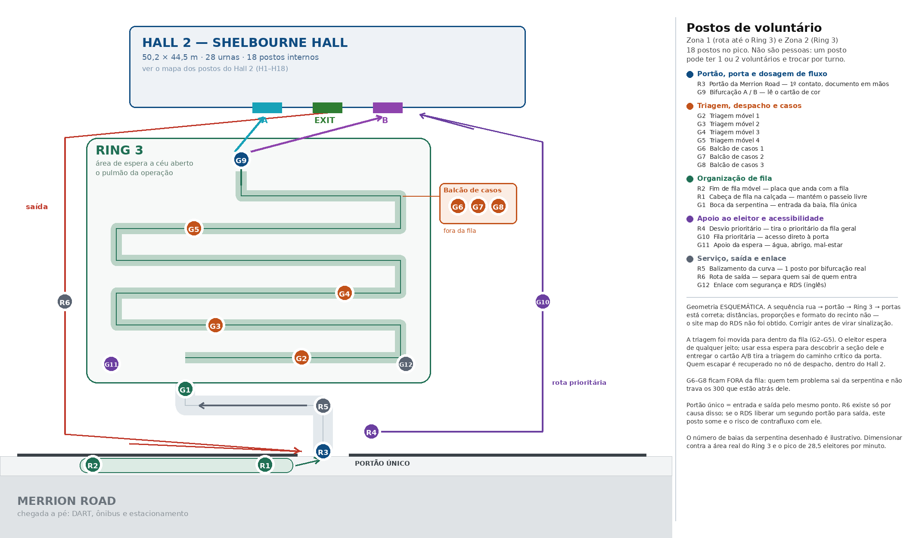
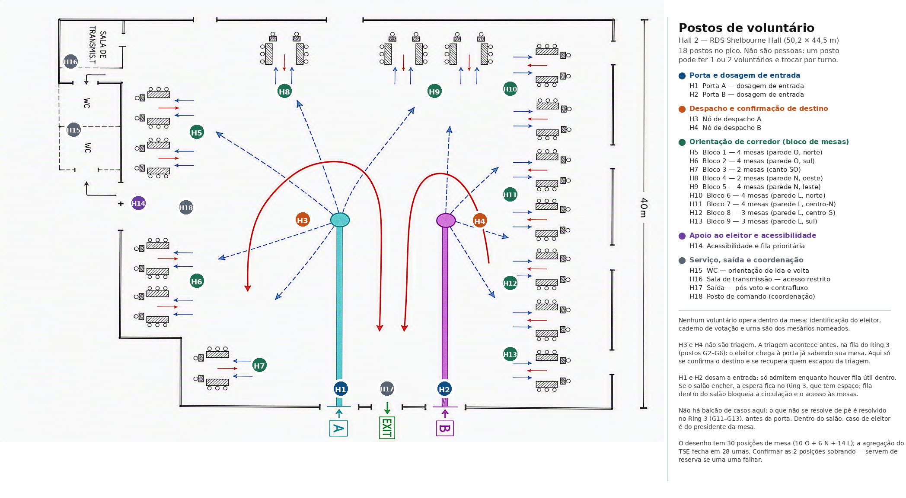

# Postos de voluntário — Dublin, 1º turno de 04/10/2026

Onde cada voluntário fica e o que faz, em três zonas: a rota do eleitor até o
Ring 3, o Ring 3 e o interior do Hall 2. Conta **postos**, não pessoas — quantas
pessoas ocupam cada posto e em quantos turnos é decisão de quem recruta.

Os números saem de `scripts/voluntarios.py`, que lê o eleitorado real
(`saidas/dados.json`). A tabela completa está em
`saidas/postos_voluntarios.md`.

## Resultado em uma linha

**36 postos no pico**: 6 na rota, 12 no Ring 3 e 18 dentro do Hall 2.

| Zona | Postos | Códigos |
|---|---|---|
| 1. Rota — calçada, portão e caminho interno | 6 | R1–R6 |
| 2. Ring 3 — área de espera a céu aberto | 12 | G1–G12 |
| 3. Hall 2 — salão de votação | 18 | H1–H18 |
| **Total** | **36** | |

## O que é um posto

Um posto é uma função a cobrir num lugar. Pode ser ocupado por uma pessoa ou
por duas, e trocar de ocupante a cada turno. Catorze dos 36 são postos
**móveis** — a triagem na fila (G2–G5), o fim de fila (R2) e a orientação de
corredor (H5–H13): o lugar é um trecho, não um ponto.

Os 36 são a contagem **no pico**, entre 10h e 12h. Os dois postos calculados
por vazão encolhem junto com o fluxo:

| Hora | Eleitores/min | Triagem móvel | Balcão de casos |
|---|---|---|---|
| 08–09 | 15,2 | 3 | 2 |
| 10–12 (pico) | 28,5 | 4 | 3 |
| 13–16 | 21 a 17 | 3 | 2 |
| 16–17 | 13,3 | 2 | 1 |

Os outros 31 postos existem enquanto houver votação. R3 é o único que **dobra**
de efetivo, na abertura, por causa da fila já formada às 8h.

## A restrição que estrutura tudo

A Mesa Receptora de Votos é a **mesa**, não a urna: presidente, 1º e 2º
mesários e secretários. Identificar o eleitor e manusear o caderno de votação é
função de mesário **nomeado pela Justiça Eleitoral**. Nenhum dos 36 postos
encosta na mesa.

A figura formal para o que este plano descreve é **apoio logístico**, também
nomeado pela Justiça Eleitoral. O prazo de nomeação das Eleições 2026 terminou
em **28/08/2026**, já vencido — confirmar a situação com o Cartório Eleitoral
antes de escalar qualquer pessoa. Fontes e detalhe em
[§ Pendências](#pendências).

O ganho do voluntário não é velocidade de votação — essa é limitada pelos
mesários e pela urna. É impedir que o eleitor chegue à mesa errada, na fila
errada, sem documento, ou desista antes de chegar.

## A decisão de desenho que muda o resto

**A triagem saiu da porta e foi para dentro da fila do Ring 3.**

Na versão anterior deste plano, a triagem ficava nas entradas A e B: 8 postos
atendendo 28,5 eleitores por minuto, com utilização de 80% para a fila não
explodir. Era o gargalo não paralelizável que o `contexto_eleicoes_dublin_2026.md`
já apontava.

Com o Ring 3 confirmado como área de espera a céu aberto, a triagem passa a ser
feita por voluntários que **percorrem a serpentina** (G2–G5), perguntam a seção,
entregam um cartão de cor A ou B e resolvem a dúvida enquanto o eleitor já está
parado esperando. Três consequências:

1. **Sai do caminho crítico.** A triagem deixa de ser uma etapa que o eleitor
   atravessa e passa a acontecer durante uma espera que existiria de qualquer
   forma.
2. **A falha vira suave.** Quem escapar da triagem não trava ninguém: é
   recuperado no nó de despacho dentro do salão (H3/H4). Por isso os postos de
   triagem móvel não precisam da folga de utilização de 80% — podem trabalhar
   no talo.
3. **Ganha o efeito de grupo.** Eleitor chega em dupla e em família; uma
   pergunta respondida em voz alta serve a 1,5 pessoa em média.

O efeito combinado derruba a triagem de 8 postos para 4. Não é mágica
aritmética: é (a) remover a folga de utilização, que só era necessária porque a
fila da triagem não tinha válvula de escape, e (b) contar interações em vez de
pessoas.

## Zona 1 — Rota do eleitor até o Ring 3



| Código | Posto | Onde fica | O que faz |
|---|---|---|---|
| R1 | Cabeça de fila na calçada | Calçada da Merrion Road, junto ao portão | Mantém o passeio transitável e encaminha quem chega a pé |
| R2 | Fim de fila móvel | Extremidade da fila, onde ela estiver | Carrega a placa de fim de fila e caminha com ela |
| R3 | Portão da Merrion Road | No portão | 1º contato: confirma que é o lugar certo, manda preparar o documento. Dobra na abertura |
| R4 | Desvio prioritário | Logo após o portão | Tira idoso, PcD, gestante e criança de colo da fila geral antes que entrem nela |
| R5 | Balizamento da curva | Na curva entre o portão e o Ring 3 | Um posto por bifurcação do traçado real |
| R6 | Rota de saída | No caminho de retorno ao portão | Separa quem sai de quem entra |

Duas observações de desenho.

**O portão único é a fragilidade da zona 1.** Entrada e saída pelo mesmo ponto
significa que os dois fluxos se cruzam em algum lugar — no desenho, entre a
saída do Hall 2 e o portão. R6 existe só por causa disso. Se o RDS liberar um
segundo portão para saída, R6 desaparece e o risco de contrafluxo com ele. Vale
pedir.

**R2 parece supérfluo e não é.** Numa fila de rua sem fim visível, o eleitor que
chega não sabe onde ela começa e ou fura sem querer, ou desiste. Uma placa que
caminha com a cauda da fila resolve os dois.

## Zona 2 — No Ring 3

| Código | Posto | Onde fica | O que faz |
|---|---|---|---|
| G1 | Boca da serpentina | Entrada da área de espera | Organiza a entrada na primeira baia; impede que a fila única se parta em várias |
| G2–G5 | Triagem móvel | Percorrendo a serpentina | Pergunta a seção, entrega o cartão A/B, resolve dúvida de pé |
| G6–G8 | Balcão de casos | Mesa fixa **fora** da fila | Título, eleitor não localizado, transferência — com listagem impressa e consulta eletrônica |
| G9 | Bifurcação A / B | Saída da serpentina | Lê o cartão de cor e manda para a porta certa |
| G10 | Fila prioritária | Rota paralela, por fora da serpentina | Conduz prioritários direto à porta |
| G11 | Apoio da espera | Dentro do Ring 3 | Água, abrigo de chuva, mal-estar, criança perdida, WC |
| G12 | Enlace com segurança e RDS | Borda do Ring 3 | Ponto único de contato com os 20 seguranças e com o staff do RDS. Requer inglês |

**Por que o balcão fica fora da fila.** Um eleitor com problema parado dentro da
serpentina trava os 300 que estão atrás dele. Fora dela, trava só a si mesmo. É
a mesma lógica de uma faixa de escape numa descida.

**G11 é o posto mais sensível ao clima.** O Ring 3 é a céu aberto em 4 de
outubro em Dublin. Se chover no pico, este posto sozinho decide quanta gente
desiste da fila — e vale dimensionar abrigo antes de dimensionar gente.

## Zona 3 — Dentro do Hall 2



| Código | Posto | O que faz |
|---|---|---|
| H1, H2 | Portas A e B — dosagem de entrada | Só admitem enquanto houver fila útil dentro. Se o salão encher, a espera fica no Ring 3, que tem espaço |
| H3, H4 | Nós de despacho A e B | No ponto onde as filas se abrem em leque: confirmam o destino e recuperam quem escapou da triagem |
| H5–H13 | Orientação de corredor | Um posto por bloco de mesas (9 blocos: 4+4+2+2+4+4+4+3+3) |
| H14 | Acessibilidade e fila prioritária | Recebe a fila prioritária e acompanha até a mesa |
| H15 | WC | Os WC ficam fora do salão, num corredor lateral — sem orientação, quem sai perde o lugar e volta pela porta errada |
| H16 | Sala de transmissão | Controle de acesso à área restrita |
| H17 | Saída — pós-voto | Conduz para fora e impede retorno contra o fluxo |
| H18 | Posto de comando | Coordenação do salão, em ponto fixo e visível |

**H1 e H2 são o posto mais contraintuitivo do plano.** A tentação é deixar
entrar sempre que há espaço na porta. O certo é o oposto: fila dentro do salão
bloqueia circulação e acesso às mesas, e não há para onde ela crescer. Fila no
Ring 3 tem espaço, tem apoio e tem triagem acontecendo. A porta deve segurar.

**Não há balcão de casos dentro do salão.** O que não se resolve de pé foi
resolvido no Ring 3, antes da porta. Dentro do salão, caso de eleitor é do
presidente da mesa — e o voluntário encaminha, não decide.

## De onde vem cada número

Três postos são calculados a partir do fluxo; os outros 27 são posicionais —
existem porque há um lugar a cobrir.

| Posto | Qtd. | Cálculo |
|---|---|---|
| G2–G5 triagem móvel | 4 | 28,5 eleitores/min × 60% que pedem orientação ÷ 1,5 eleitor por interação × 20 s |
| G6–G8 balcão de casos | 3 | 28,5/min × 3% de casos difíceis × 120 s, com utilização de 80% |
| H5–H13 corredor | 9 | 30 posições de mesa ÷ 3,5 por bloco |

O pico de 28,5 eleitores por minuto vem de 16.794 aptos → 11.416 comparecimentos
esperados (74% Dublin, 50% interior, taxas de 2022) → 1.713 eleitores na hora
de pico, entre 10h e 12h.

**A curva de chegada horária continua sendo a premissa mais frágil.** É
assumida; não há série histórica do posto. Se houver a contagem horária de
2022, substituir em `PREMISSAS["curva_chegada"]` e rodar de novo.

## O que muda o número de postos

1. **Um segundo portão para saída** — elimina R6 e o cruzamento de fluxos.
2. **Sinalização e divulgação prévia da seção.** Cada 10 pontos percentuais a
   menos de eleitores que precisam perguntar algo tiram cerca de 0,6 posto da
   triagem móvel. Os EUR 1.961 já orçados em banners e a divulgação pelo
   Instagram e pelo e-Título puxam nessa direção.
3. **Renegociação da agregação com o TSE.** Se as 28 urnas virarem 32–38, os
   blocos de corredor sobem para 10–11. A triagem e a rota não mudam: dependem
   do fluxo de eleitores, não do número de urnas.
4. **Chuva no pico** — não muda a contagem, muda a prioridade: G11 e abrigo
   passam à frente de tudo.

## Pendências

1. **Nomeação de apoio logístico fora do prazo (28/08/2026).** Confirmar com o
   Cartório Eleitoral/ZZ: se já há apoio logístico nomeado e quantos; se cabe
   nomeação complementar para seções no exterior; ou sob que figura os
   colaboradores atuarão. Muda seguro, folga compensatória e crachá — não o
   número de postos. Fontes:
   [TSE — prazo de nomeação](https://www.tse.jus.br/comunicacao/noticias/2026/Agosto/termina-nesta-sexta-feira-28-prazo-para-nomeacao-de-mesarios-e-apoio-logistico),
   [TSE — mesas receptoras](https://www.tse.jus.br/comunicacao/noticias/2026/Abril/por-dentro-das-eleicoes-entenda-o-que-sao-e-como-funcionam-as-mesas-receptoras-de-votos),
   [Resolução TSE nº 23.751/2026](https://www.tse.jus.br/legislacao/compilada/res/2026/resolucao-no-23-751-de-26-de-fevereiro-de-2026)
   (texto integral não lido — conferir).
2. **Geometria real do recinto.** O mapa das zonas 1 e 2 é esquemático: a
   sequência rua → portão → Ring 3 → portas está correta, as distâncias e o
   formato do recinto não. O site map do RDS não pôde ser obtido. Corrigir
   antes de virar sinalização.
3. **Capacidade do Ring 3.** O número de baias da serpentina desenhado é
   ilustrativo. Dimensionar contra a área real e contra o pico de 28,5
   eleitores por minuto.
4. **30 posições de mesa no desenho, 28 urnas na agregação do TSE.** Confirmar
   as duas sobrando — servem de reserva se uma urna falhar.
5. **Dimensões do Hall 2 confirmadas:** 50,2 × 44,5 m, 2.238 m² (ficha técnica
   do RDS em `RDS_Hall_2_Floorplan_(1).pdf`), coerente com os 50 × 44,5 usados
   nas simulações de layout. Esta pendência do contexto original está fechada.

## Como recalcular e redesenhar

```bash
cd scripts
python3 voluntarios.py         # postos_voluntarios.{json,md}
python3 postos_hall2.py        # postos_hall2.png  (sobre o desenho atual)
python3 postos_rota_ring3.py   # postos_rota_ring3.png
```

Os códigos dos postos são gerados pelo modelo a partir da ordem e das
quantidades, e os dois desenhos conferem os códigos que marcam contra o JSON —
se o modelo mudar e o mapa não, o desenho falha em vez de sair errado.
