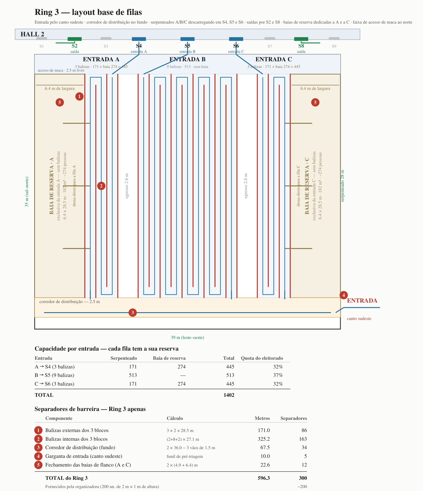

# Plano base do Ring 3 — RDS Ballsbridge, 04/10/2026

Escopo: **apenas o Ring 3**. A análise que o sustenta está em
`saidas/analise_gargalos.md`. Desenho em escala: `saidas/layout_ring3.svg`,
gerado por `scripts/layout_ring3.py`.

Premissas fixadas: 28 urnas / 28 mesas (1:1), identificação por **caderno
físico**, **Hall 2 + Ring 3 sem cobertura**, **piso pavimentado**, espaço
**locado desde a véspera** — não há carros estacionados a remover.

---

## 1. Dimensões adotadas

Estimadas por fotogrametria sobre imagem aérea, com escala ancorada em feições
de solo (carros, vagas, largura da R118, copas), não em telhados — a imagem é
oblíqua e telhado de prédio alto não coincide com sua projeção no solo. Escala
apurada: **0,15 m/px**, com quatro aferições independentes convergindo.

| Área | Dimensão | Superfície |
|---|---|---|
| **Ring 3** | **~39 m (leste–oeste) × ~35 m (sul–norte)** | **~1.365 m²** |
| Apron pavimentado entre o Ring 3 e a fachada sul do Hall 2 | ~60 × 14 m | ~850 m² |

Incerteza: **±10–15% nas dimensões lineares**. Suficiente para dimensionar,
insuficiente para contrato. Aferir com a ferramenta "Medir distância" do Google
Maps ou com a planta do recinto.

## 2. Portas do Hall 2

A fachada sul do Hall 2, que encara o Ring 3, tem **nove aberturas, S1 a S9**,
conforme a prancheta do Posto. Papéis definidos:

| Porta | Distância do canto sudoeste | Papel |
|---|---|---|
| S1 | 9,5 m | — |
| **S2** | **13,7 m** | **SAÍDA** |
| S3 | 17,7 m | — |
| **S4** | **21,9 m** | **ENTRADA A** |
| **S5** | **28,1 m** | **ENTRADA B** |
| **S6** | **34,3 m** | **ENTRADA C** |
| S7 | 38,6 m | — |
| **S8** | **42,6 m** | **SAÍDA** |
| S9 | 46,8 m | — |

Distâncias medidas na prancheta e convertidas pela largura declarada de 50,2 m
(escala ~22,5 px/m) — a confirmar em campo.

Duas consequências de projeto:

**As três entradas estão a 6,2 m uma da outra.** É um passo apertado: um bloco
de fila de 7,0 m não cabe nesse intervalo sem invadir o vizinho. Daí a faixa de
descarga (item 3).

**As saídas estão nos flancos, fora do vão das entradas** — S2 a 13,7 m e S8 a
42,6 m, enquanto as entradas ocupam de 21,9 a 34,3 m. Isso é uma vantagem: quem
sai do Hall 2 se afasta lateralmente, sem cruzar nenhuma fila de entrada. O
fluxo se separa sozinho, sem barreira adicional.

*Observação:* a planta `RDS_Hall_2_Floorplan_(1).pdf` numera as mesmas
aberturas como 2.1 a 2.23, com posições que não coincidem exatamente com as
lidas na prancheta. A aferição em campo resolve a divergência.

## 3. Layout

*Fonte: `saidas/layout_ring3.svg`, gerado por `scripts/layout_ring3.py`.*

O eleitor entra pelo **canto sudeste**, percorre o **corredor de distribuição**
no fundo (bordo sul) de leste para oeste, e é desviado para o serpenteado da
sua urna — **C** primeiro, depois **B**, depois **A**. Cada serpenteado
descarrega ao norte, na sua porta.

| Parâmetro | Valor |
|---|---|
| Corredor de distribuição (fundo) | 2,5 m, todo o bordo sul |
| Profundidade do serpenteado | 26,0 m |
| Largura de baliza | 1,40 m |
| Corredor de egresso entre blocos | 2,6 m |
| Baia de reserva | 5,0 m em cada flanco |
| Faixa de descarga | 5,0 m |

### Capacidade por entrada

| Entrada | Balizas | Serpenteado | Baia de reserva | **Total** | Quota |
|---|---|---|---|---|---|
| **A → S4** | 5 | 260 | 195 | **455** | 36% |
| **B → S5** | 7 | 364 | — | **364** | 29% |
| **C → S6** | 5 | 260 | 195 | **455** | 36% |
| | | 884 | 390 | **1.274** | |

### A reserva é por entrada, não é um depósito comum

Esta é a correção mais importante em relação à versão anterior do plano, que
tratava os flancos como uma "reserva" genérica.

**Reserva comum não serve.** O eleitor só vota na urna da sua seção, e a
entrada A, B ou C é definida por essa seção. Acumular gente sem separação
destrói o roteamento feito na pré-triagem: na hora de liberar, seria preciso
re-triar chamando "quem é da entrada B?", o que reintroduz um gargalo no ponto
exato onde ele não pode existir, e quebra a ordem de chegada.

Por isso as baias são **dedicadas**. A do flanco oeste serve **só a A**; a do
flanco leste, **só a C**. Cada uma encosta na **baliza de entrada** do seu
bloco e drena direto para dentro dele, sem devolver ninguém ao corredor de
fundo. É o que justifica **espelhar o bloco A**: espelhado, sua baliza de
entrada fica a oeste, encostada na baia — e, de quebra, sua baliza de saída
cai sobre S4.

### E a entrada B?

**B não tem flanco, e não há como criar um.** Ela está no meio, com corredor
de egresso dos dois lados; ocupar esses corredores anularia a evacuação, que é
justamente o que não se pode negociar com 884 pessoas em fila atrás de barreira
de 1 m de altura.

A compensação é dar a B **profundidade de fila em vez de área de reserva**:
**7 balizas em vez de 5**, o que leva seu serpenteado de 260 para **364
pessoas**. Custa 2,8 m de largura, tirados dos corredores de egresso (de 4,0
para 2,6 m — ainda acima do mínimo).

Isso não iguala B a A e C (364 contra 455), e não há geometria que iguale: 9
balizas em B deixariam os egressos em 1,2 m, o que é inaceitável. **A solução
não é geométrica, é de atribuição** — ver seção 5.

## 4. Necessidade de separadores de barreira

**Este quantitativo cobre somente o Ring 3.** O interior do Hall 2 — filas
junto às 28 urnas, canalização das portas para dentro, separação dos fluxos de
saída — tem necessidade própria, ainda não dimensionada.

| # | Componente | Cálculo | Metros | Separadores |
|---|---|---|---|---|
| 1 | Balizas externas dos 3 blocos | 3 × 2 × 26,0 m | 156,0 | 78 |
| 2 | Balizas internas dos 3 blocos | (4+6+4) × 24,6 m | 344,4 | 173 |
| 3 | Corredor de distribuição (fundo) | 2 × 36,0 − 3 vãos de 1,5 m | 67,5 | 34 |
| 4 | Garganta de entrada (canto sudeste) | funil de pré-triagem | 10,0 | 5 |
| 5 | Canais de descarga até S4/S5/S6 | 2 lados × (5,4 + 6,5 + 5,4) m | 34,6 | 18 |
| 6 | Fechamento das baias de flanco (A e C) | 2 × (3,5 + 5,0) m | 17,0 | 9 |
| | **TOTAL DO RING 3** | | **629,5** | **317** |
| | Fornecidos pela organizadora | 200 un. de 2 m × 1 m de altura | −400,0 | −200 |
| | **A ADQUIRIR** | | **234,0** | **117** |

> **117 separadores adicionais ≈ EUR 1.523**, ao custo unitário de referência
> (EUR 1.303,00 ÷ 200 m = EUR 6,51/m). São ~10% do orçamento revisado de
> EUR 15.703,32.

As balizas dominam: os itens 1 e 2 somam 500 m, **79% do total**. As duas
balizas extras de B custam 49 m (25 separadores, ~EUR 320) e rendem 104
pessoas — a capacidade mais barata do plano.

**Especificação recebida:** separadores de barreira externa, **2 m de
comprimento × 1 m de altura**, fornecidos pela empresa organizadora. A altura
de 1 m canaliza fila, mas **não é barreira de contenção de multidão** — não
suporta carga lateral de uma massa sob pressão. É o que sustenta os corredores
de egresso e a liberação em lotes.

## 5. Atribuição das urnas às entradas

As três entradas não têm a mesma capacidade, então a carga tem de ser repartida
**na proporção dessa capacidade**, e não em terços. Reproduzível com
`python3 -c "import sys; sys.path.insert(0,'scripts'); import simula_fluxo as m; m._relatorio_entradas()"`.

| Entrada | Urnas | Comparecimento esperado | Quota obtida | Alvo | Desvio |
|---|---|---|---|---|---|
| **A** | 10 | 4.094 | 35,9% | 4.076 | +19 |
| **B** | 8 | 3.221 | 28,2% | 3.265 | −44 |
| **C** | 10 | 4.101 | 35,9% | 4.076 | +25 |
| | 28 | 11.416 | | | |

O desvio máximo é de 44 eleitores em 11.416 — **0,4%**. A menor capacidade de
B deixa de ser um problema porque B recebe menos eleitorado.

- **A:** 511, 513, 1352, 3161, 3302, 3306, 3308, 3309, **3313**, 3688
- **B:** 517, 1160, 3078, 3229, 3305, 3311, **3315**, 3832
- **C:** 512, 3054, 3108, 3142, 3179, 3216, 3245, **3322**, 3442, 3862

**As três urnas T1 vão para entradas diferentes** — 3313 em A, 3315 em B, 3322
em C. Concentrar as três (590 eleitores esperados cada) numa só entrada criaria
um pico que nenhuma reserva absorveria, e são justamente elas que definem o
horário de fechamento (ver `analise_gargalos.md`).

## 6. O Ring 3 comporta a fila prevista?

Da coluna FILA TOTAL de `scripts/simula_fluxo.py`, comparada à capacidade do
Hall 2 (~1.000–1.200 em fila interna) somada às ~1.300 do Ring 3:

| Arranjo da mesa | Fila total no pico | Cabe em Hall 2 (~1.100) + Ring 3 (~1.274)? |
|---|---|---|
| Dois cadernos em paralelo, qualquer t_id | 0 | Sim — o Ring 3 nem abre |
| Pipeline, t_id 55 s | 439 | Sim, só no Hall 2 |
| Serial, t_id 45 s | 1.058 | Sim, só no Hall 2 |
| Serial, t_id 55 s | 1.637 | Sim, com os serpenteados |
| Serial, t_id 65 s | 2.240 | Sim, com o flanco aberto |
| Serial, t_id 75 s | 2.974 | **Não — transborda para a Merrion Road** |

**O Ring 3 não resolve o gargalo; ele compra tempo.** Quem resolve é o arranjo
de dois cadernos em paralelo por urna, que fecha às 17h00 mesmo com caderno
lento e não custa nada ao TRE.

## 7. Evacuação e densidade

Referências de crowd safety para evento ao ar livre: escoamento de **82 pessoas
por metro de largura por minuto**, alvo de evacuação de **8 a 10 minutos**, e
**2 pessoas/m²** como densidade de referência para cálculo de capacidade
segura. Conferência reproduzível em `scripts/layout_ring3.py`.

| Verificação | Valor | Situação |
|---|---|---|
| Densidade no serpenteado | 1,43 p/m² | OK (limite 2,0) |
| Densidade na baia de reserva | 1,50 p/m² | OK (limite 2,0) |
| Corredor entre blocos, como rota de pedestres | 2,6 m | OK (mínimo 1,2 m) |
| Corredor entre blocos, como acesso de veículo | 2,6 m | **Não admite** (mínimo 3,5 m) |
| Largura de saída exigida (1.274 pessoas / 8 min) | **1,94 m** | — |
| Largura de saída designada hoje | **1,50 m** (só a garganta sudeste) | **Insuficiente — 10,4 min** |

### O que o corredor entre blocos faz, e o que não faz

Ele serve a **quatro** funções, e evacuação é só uma delas:

1. rota de saída lateral para quem está dentro do serpenteado — sem ela, sair
   de uma fila de 130 m de percurso significa percorrer os 130 m;
2. circulação de marshals ao longo das filas, sem atravessá-las;
3. acesso de socorro **a pé** — maca passa em 1,2 m;
4. separação entre filas vizinhas, que é o que impede a fila de B de contaminar
   a de C.

Aos 2,6 m ele cumpre as quatro com folga sobre o mínimo de 1,2 m. **Mas deixou
de admitir veículo de emergência**, que exige 3,5 m — e admitia, aos 4,0 m da
versão anterior. Essa perda foi o preço das duas balizas extras da entrada B, e
é uma decisão que cabe ao Posto, não ao desenho: rota de veículo até o meio do
Ring 3 ou 104 pessoas a mais de fila em B.

Se a rota de veículo for exigida, ela não precisa passar entre os blocos: a
**faixa de descarga tem 5,0 m** e atravessa toda a largura ao norte. É por ali
que um veículo deve entrar, não pelos corredores de fila.

### A fragilidade real não são os corredores

**O Ring 3 tem hoje uma única saída designada: a garganta do canto sudeste.**
Os três canais ao norte levam para dentro do Hall 2 — inúteis se a emergência
for justamente no Hall 2.

1.274 pessoas por uma garganta de 1,5 m levam **10,4 minutos**, acima do alvo
de 8. E é pior do que a conta sugere, porque toda a população converge para um
ponto único: qualquer obstrução ali não deixa alternativa.

**Recomendação: abrir duas brechas de emergência de 2,0 m no perímetro sul e
leste**, em pontos distintos e distantes da garganta, sinalizadas e mantidas
desobstruídas. Com elas a evacuação cai para **2,8 minutos**, e nenhum ponto
isolado é crítico.

Duas atenuantes que não substituem a medida: os separadores têm 1 m de altura e
são leves e autoportantes — numa emergência real são derrubados, e é assim que
funcionam; e o Ring 3 é área aberta, sem fumaça nem risco estrutural, o que
torna a evacuação menos crítica do que em espaço fechado.

**Pendência que decide tudo isto:** não sei se o perímetro do Ring 3 é fechado
ou aberto. Pela imagem aérea há linha de árvores e meio-fio, mas não dá para
saber se há vãos. Se o perímetro for francamente aberto, o problema se dissolve
e as brechas viram sinalização. Se for fechado, elas são obrigatórias.

## 8. Exposição ao tempo

O espaço é descoberto. Outubro é o mês mais chuvoso de Dublin (**76–79 mm**). O
número de dias de chuva diverge conforme a fonte e o limiar: **12 dias** pelas
normais de 30 anos (1991–2020, limiar ≥1 mm) e **17–20** em fontes de limiar
mais frouxo — ou seja, **~40% a ~65%** de probabilidade para o dia 4. As fontes
não são metodologicamente comparáveis entre si.

Com piso pavimentado, o risco não é de lama nem de arraste para junto dos
pontos elétricos. É de **exposição**: gente parada 20–40 minutos na chuva
desiste. Desistência por fila é privação de voto que não aparece em nenhuma
estatística de comparecimento — e, ironicamente, *melhora* as métricas de
tempo por via indesejada.

Mitigação proporcional ao risco: cobertura leve (tenda ou toldo) sobre os
últimos 8–10 m de cada serpenteado, onde a espera é mais longa e a densidade
maior; e não sobre os 27 m inteiros. Cotar como item destacado.

## 9. Acessibilidade e atendimento prioritário

**211 eleitores com 60+ anos e 85 com deficiência declarada** em toda a zona —
~296 pessoas em 9 horas, ~33 por hora no pico. Volume trivial, desde que
roteado à parte.

**Nenhum eleitor prioritário entra no serpenteado.** Rota dedicada pelo apron
pavimentado, do desembarque direto à porta, com 1 agente designado. As balizas
de 1,40 m acomodam cadeira de rodas, mas 5 balizas de 26 m são **130 m de
percurso** — inaceitável para quem tem prioridade legal.

## 10. Equipe

| Função | Nº | Observação |
|---|---|---|
| Coordenador do Ring 3 | 1 | Decide abertura do flanco e ritmo de liberação |
| Agentes de pré-triagem (garganta sudeste) | 3 | Entregam o cartão de roteamento; gargalo potencial — dimensionar para o pico |
| Marshals de corredor | 3 | 1 por serpenteado |
| Marshals de descarga | 3 | 1 por porta (S4, S5, S6), em contato com o interior do Hall 2 |
| Agente de acessibilidade | 1 | Rota prioritária pelo apron |
| Segurança | 4–6 | Dos 20 já contratados (item a) |
| **Total** | **15–17** | dos quais 4–6 já orçados |

## 11. Pendências

1. Aferir as dimensões do Ring 3 e **a distância entre o bordo oeste do Ring 3
   e o canto sudoeste do Hall 2** — é o número que translada todo o conjunto
   para os eixos coincidirem com as portas 2.7, 2.4 e 2.1.
2. Conciliar a numeração S1–S9 da prancheta com a numeração 2.1–2.23 da
   planta do RDS, que dão posições divergentes para as mesmas aberturas.
3. Submeter o pedido de **+117 separadores (~EUR 1.523)** para o Ring 3, e
   dimensionar à parte a necessidade do interior do Hall 2.
4. Cotar cobertura leve para os últimos 8–10 m de cada serpenteado.
5. **Verificar se o perímetro do Ring 3 é fechado ou aberto** e, se fechado,
   abrir duas brechas de emergência de 2,0 m (ver seção 7).
6. Decidir se a rota de veículo de emergência precisa alcançar o meio do
   Ring 3 — hoje os corredores entre blocos têm 2,6 m e não a admitem.
7. Definir o arranjo da mesa receptora com o Cartório Eleitoral — **é o que
   determina se o Ring 3 chega a ser usado**.
